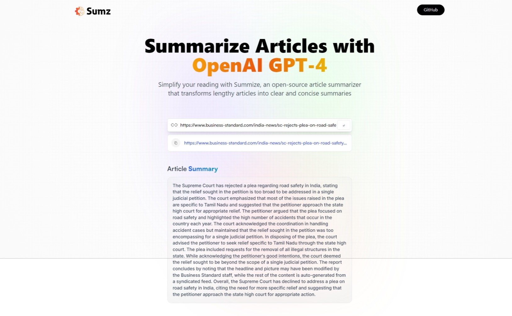

# AI Article Summarizer with Vite and React



## Overview

The AI Article Summarizer is a web application built with Vite and React that allows users to automatically summarize articles and web pages using advanced natural language processing (NLP) techniques. It leverages the "Article Extractor and Summarizer" API from Rapid API to efficiently extract and summarize article content.

## Features

- Responsive and intuitive user interface built with React.
- Real-time article summarization using advanced NLP techniques.
- Efficient fetching and processing of article content from a provided URL.
- Presents a concise and coherent summary for easy reading.
- Designed to save users time and effort in consuming lengthy articles.

## How it Works

The AI Article Summarizer follows these steps:

1. The user provides a URL of the article they want to summarize.
2. The application fetches the article content from the provided URL using the "Article Extractor and Summarizer" API.
3. The API processes the article using NLP algorithms to understand its context and extract essential information.
4. The React frontend displays the generated summary to the user, providing a quick overview of the article's content.

## Requirements

To run the AI Article Summarizer locally, you need the following:

- Node.js (version 14 or above)
- npm (Node Package Manager)
- A valid API key from Rapid API (URL: https://rapidapi.com/restyler/api/article-extractor-and-summarizer)

## Installation

1. Clone the repository:

```bash
git clone git@github.com:vinaykumar-l/AI-article-summarizer.git
cd AI-article-summarizer
```

2. Install dependencies:

```bash
npm install
```

3. Set up the Rapid API key:

   - Sign up for an account at https://rapidapi.com/
   - Obtain your API key from the dashboard.
   - Replace `YOUR_RAPID_API_KEY` in the `.env` file with your actual API key.

## Usage

To run the AI Article Summarizer, follow these steps:

```bash
npm run dev
```

This will start a development server, and you can access the application in your web browser at `http://localhost:3000`.

1. Enter the URL of the article you want to summarize in the input field provided.
2. Click the "Summarize" button.
3. The application will fetch and process the article, and after a moment, it will display the summarized content.

## Examples

Here are a few examples of how the AI Article Summarizer can be used:

1. Summarize news articles to get the main highlights quickly.
2. Generate a summary of research papers to understand their key findings.
3. Summarize blog posts or long articles to get the main points without reading the entire content.
